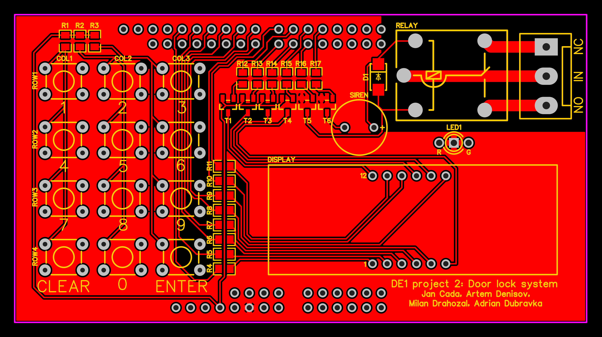

# DE1 project 2: Door lock system with PIN (4-digit) terminal, 4x3 push buttons, 4-digit 7-segment display, relay for door lock control

### Team members

- Jan Čada
- Artem Denisov
- Milan Drahozal
- Adrián Dúbravka

[Link to GitHub project folder](http://github.com/xcadaj00/DE1_project)

### Project objectives

Write your text here.

## Hardware description

Used components are connected to Arty A7 board as shield. PCB is designed in easyEDA. 

### Table(s) of pins and ports

### Tables of components

#### Resistor

| **Label** | **Value** | **Package** | **Quantity** | **Link** |
| :-: | :-: | :-: | :-: | :-: | 
| R1 - R3   | 10K  | 0805 | 3 | [GMe.cz](https://www.gme.cz/r0805-10k-5-yageo) | 
| R4 - R11  | 100R | 0805 | 8 | [GMe.cz](https://www.gme.cz/tc-0104) |
| R12 - R17 | 1K   | 0805 | 6 | [GMe.cz](https://www.gme.cz/r0805-100r-1-yageo) |
| R18       | 110R | 0805 | 1 | [GMe.cz](https://www.gme.cz/r0805-110r-5-yageo) |
| R19       | 130R | 0805 | 1 | [GMe.cz](https://www.gme.cz/r0805-130r-5-yageo) | 

#### Transistor

| **Label** | **Details** | **Type** | **Package** | **Quantity** | **Link** |
| :-: | :-: | :-: | :-: | :-: | :-: |
| T1-T4 | PNP | BC807 | SOT23 | 4 | [GMe.cz](https://www.gme.cz/bipolarni-tranzistor-bc807-16-sot23) |
| T5-T6 | NPN | BC817 | SOT23 | 2 | [GMe.cz](https://www.gme.cz/bipolarni-tranzistor-bc817-40-sot23) |

#### Diode

| **Label** | **Type** | **Package** | **Quantity** | **Link** |
| :-: | :-: | :-: | :-: | :-: |
| D1 | 1N4007 | SOD-123FL | 1 | [GMe.cz](https://www.gme.cz/dioda-1n4007w) |

#### LED

| **Label** | **Type** |**Color** | **Voltage** | **Package** | **Quantity** | **Link** |
| :-: | :-: | :-: | :-: | :-: | :-: | :-: |
| LED1 | LED-BEG204 | Red/Green | 2.0V/2.2V | T1 3/4 | 1 | [GMe.cz](https://www.gme.cz/led-5mm-rg-cc-45-45-50-led-beg204) |

#### Display

| **Label** | **Type** | **Details** | **Color** | **Quantity** | **Link** |
| :-: | :-: | :-: | :-: | :-: | :-: |
| DISPLAY | HD-M514RD | 4-digit 7-segment, common anode | Red | 1 | [GMe.cz](https://www.gme.cz/led-display-14-2mm-red-hd-m514rd) |

#### Relay

| **Label** | **Input voltage** | **Maximum rating** | **Quantity** | **Link** | 
| :-: | :-: | :-: | :-: | :-: |
| RELAY | 5V DC | 250VAC/10A or 24VDC/15A | 1 | [GMe.cz](https://www.gme.cz/relras0515) |

#### Siren

| **Label** | **Voltage** | **Quantity** | **Link** | 
| :-: | :-: | :-: | :-: |
| SIREN | 5V | 1 | [GMe.cz](https://www.gme.cz/sirenka-kingstate-kxg-0905c) |

#### Switch

| **Type** | **Details** | **Quantity** | **Link** | 
| :-: | :-: | :-: | :-: |
| TC-0107-T | OFF-(ON) -> normally open | 12 | [GMe.cz](https://www.gme.cz/mikrospinac-do-dps-tc-0107-t) | 

#### Connectors

| **Component** | **Quantity** | **Link** | 
| :-: | :-: | :-: |
| 40P Male header 2.54mm | 2 | [GMe.cz](https://www.gme.cz/oboustranny-kolik-s1g40-2-54mm) |
| 3P Screw terminal 5.08mm | 1 | [GMe.cz](https://www.gme.cz/svorkovnice-sroubovaci-do-dps-ark508-3p) |

### Used parts list

- 2 pcs 40P Male header [GMe.cz](https://www.gme.cz/oboustranny-kolik-s1g40-2-54mm)
- 1 pcs 5V Relay RAS-05-15 [GMe.cz](https://www.gme.cz/relras0515)
- 1 pcs Screw terminal 3P [GMe.cz](https://www.gme.cz/svorkovnice-sroubovaci-do-dps-ark508-3p)
- 1 pcs Diode 1N4007 [GMe.cz](https://www.gme.cz/dioda-1n4007w)
- 4 pcs PNP transistor BC807 [GMe.cz](https://www.gme.cz/bipolarni-tranzistor-bc807-16-sot23)
- 2 pcs NPN transistor BC817 [GMe.cz](https://www.gme.cz/bipolarni-tranzistor-bc817-40-sot23)
- 6 pcs Resistor 1K [GMe.cz](https://www.gme.cz/r0805-1k0-5-yageo)
- 3 pcs Resistor 10K [GMe.cz](https://www.gme.cz/r0805-10k-5-yageo)
- 8 pcs Resistor 100R [GMe.cz](https://www.gme.cz/r0805-100r-1-yageo)
- 1 pcs Resistor 56R [GMe.cz](https://www.gme.cz/r0805-56r-1-yageo)
- 1 pcs Resistor 68R [GMe.cz](https://www.gme.cz/r0805-68r-5-yageo)
- 12 pcs Microswitch OFF-(ON) TC-0107-T [GMe.cz](https://www.gme.cz/mikrospinac-do-dps-tc-0107-t)
- 1 pcs 5mm LED red/green (common cathode) [GMe.cz](https://www.gme.cz/led-5mm-rg-cc-45-45-50-led-beg204)
- 1 pcs LED display red HD-M514RD (common anode) [GMe.cz](https://www.gme.cz/led-display-14-2mm-red-hd-m514rd)
- 1 pcs 5V Siren KXG0905C [GMe.cz](https://www.gme.cz/sirenka-kingstate-kxg-0905c)

### PCB design

[PCB design project](https://oshwlab.com/jan.cada/de1_project)

#### Top layer

#### Bottom layer

#### Rendered top

#### Rendered bottom

### Schematics

#### Connection of button matrix to FPGA [1]

#### Connection of button matrix to pins on Arty A7 Shield

#### Connection of 4-digit 7-segment display to pins on Arty A7 Shield

#### Connection of door lock relay to pins on Arty A7 Shield

#### Connection of LEDs to pins on Arty A7 Shield

#### Connection of siren to pins on Arty A7 Shield

## VHDL modules description and simulations

Write your text here.

## TOP module description and simulations

Write your text here.

## Video

*Write your text here*

## References

   1. Pantech. (2020, May 04). Vhdl-Code-For-Matrix-Keypad with -fpga and output shown in led,s. Retrieved April 09, 2021, from https://www.pantechsolutions.net/blog/vhdl-code-for-matrix-keypad/
