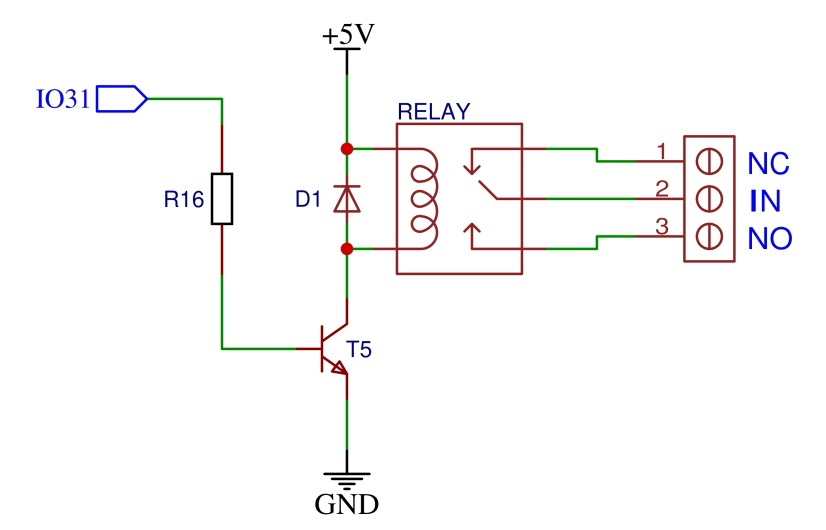
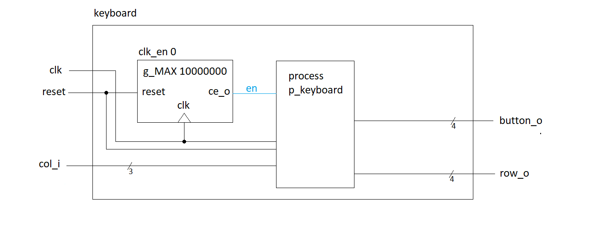
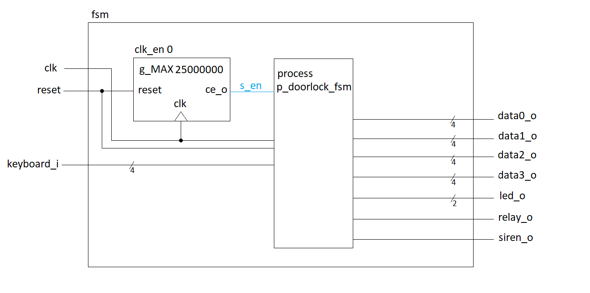
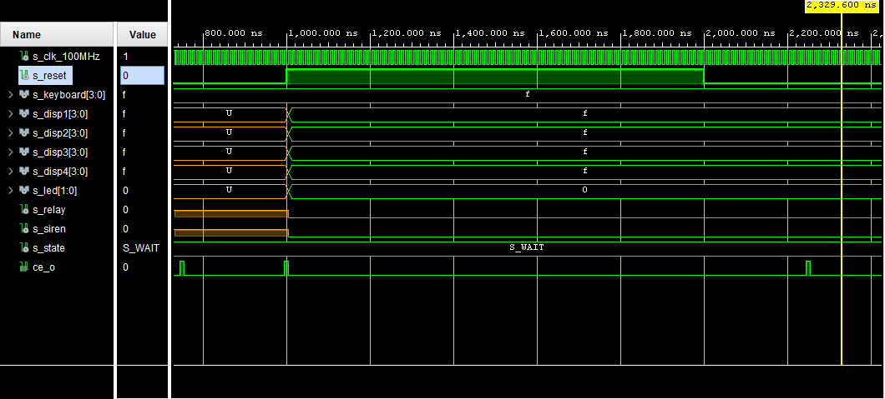
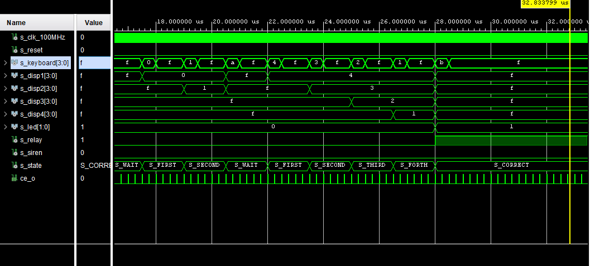
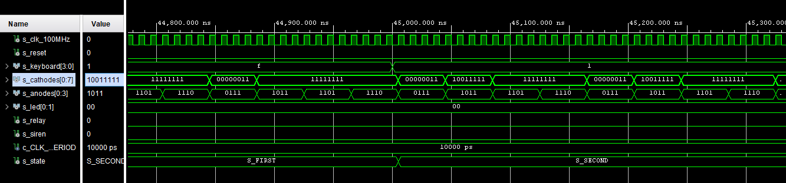

# DE1 project 2: Door lock system with PIN (4-digit) terminal, 4x3 push buttons, 4-digit 7-segment display, relay for door lock control

### Team members

- Jan Čada
- Artem Denisov
- Milan Drahozal
- Adrián Dúbravka

[Link to GitHub project folder](http://github.com/xcadaj00/DE1_project)

### Project objectives

Project goal is to implement door lock system onto board Arty A7-35T. It should have 4-digit sevensegment display to show 4-digit PIN and relay to unlock the door. 
As additional features, we decided to add small siren to produce sound when pin is incorrect and a dual color LED to light green when pin is correct or light red when pin is incorrect.

## Hardware description

Used components are connected to Arty A7 board as shield. 

### Schematics

#### Button matrix

#### 4-digit 7-segment display

#### Door lock relay

#### Red/Green LED

#### Siren

### Tables of pins and ports

#### Connection of button matrix 

| Matrix pin | Pin on board | Pin on FPGA | Comment |
| :-:  | :-:  | :-: | :-: |
| COL1 | IO41 | N17 | pullup, used as input for column 1 |
| COL2 | IO40 | P18 | pullup, used as input for column 1 |
| COL3 | IO39 | R18 | pullup, used as input for column 1 |
| ROW1 | IO38 | T18 | when 0, ROW1 buttons can turn COL pins to 0 |
| ROW2 | IO37 | U17 | when 0, ROW2 buttons can turn COL pins to 0 |
| ROW3 | IO36 | N14 | when 0, ROW3 buttons can turn COL pins to 0 |
| ROW4 | IO35 | N16 | when 0, ROW4 buttons can turn COL pins to 0 |

##### Button matrix labels

|      | COL1 | COL2 | COL3 |
| :-: | :-: | :-: | :-: |
| ROW1 | 1 | 2 | 3 |
| ROW2 | 4 | 5 | 6 |
| ROW3 | 7 | 8 | 9 |
| ROW4 | CLEAR | 0 | ENTER |

#### Connection of 7-segment displays

##### Cathodes

LEDs light up when cathode is low (i.e. 0)

| Component | display Pin | Pin on board | Pin on FPGA |
|:-: |:-: | :-:  | :-: |
| A  | 11 | IO7  | T16 |
| B  | 2  | IO8  | N15 |
| C  | 4  | IO10 | V17 |
| D  | 2  | IO12 | R17 |
| E  | 1  | IO13 | P17 |
| F  | 10 | IO34 | R16 |
| G  | 5  | IO9  | M16 |
| DP | 3  | IO11 | U18 |

##### Anodes

Transistor is open when 0V applied to its base, so digit can light up

| Component | display Pin | Pin on board | Pin on FPGA |
|    :-:    |    :-:      |     :-:      |     :-:     |
| A1 | 12 | IO6 | T15 |
| A2 | 9 | IO33 | P15 |
| A3 | 8 | IO32 | R15 |
| A4 | 6 | IO5 | T14 |

#### Connection of Relay

Relay contacts will switch when 3.3V (i.e. 1) is applied to the base of transisor

| Pin on board | Pin on FPGA |
|    :-:    |     :-:    |
| IO31 | R13 |

#### Connection of LED 

LEDs light up when anode is high (i.e. 1)

| Component | Pin on board | Pin on FPGA |
|    :-:    |    :-:     |     :-:     | 
| Green LED | IO3 | T11 |
| Red LED | IO30 | R11 |

#### Connection of Siren

Transistor is open when 3.3V (i.e. 1) is applied to its base, so SIREN will turn on 

| Pin on board | Pin on FPGA |
|    :-:    |     :-:    |
| IO4 | R12 | 

### Tables of components

#### Resistor

| **Label** | **Value** | **Package** | **Quantity** | **Link** |
| :-: | :-: | :-: | :-: | :-: | 
| R1 - R3   | 10K  | 0805 | 3 | [GMe.cz](https://www.gme.cz/r0805-10k-5-yageo) | 
| R4 - R11  | 100R | 0805 | 8 | [GMe.cz](https://www.gme.cz/tc-0104) |
| R12 - R17 | 1K   | 0805 | 6 | [GMe.cz](https://www.gme.cz/r0805-100r-1-yageo) |
| R18       | 110R | 0805 | 1 | [GMe.cz](https://www.gme.cz/r0805-110r-5-yageo) |
| R19       | 130R | 0805 | 1 | [GMe.cz](https://www.gme.cz/r0805-130r-5-yageo) | 

#### Transistor

| **Label** | **Details** | **Type** | **Package** | **Quantity** | **Link** |
| :-: | :-: | :-: | :-: | :-: | :-: |
| T1-T4 | PNP | BC807 | SOT23 | 4 | [GMe.cz](https://www.gme.cz/bipolarni-tranzistor-bc807-16-sot23) |
| T5-T6 | NPN | BC817 | SOT23 | 2 | [GMe.cz](https://www.gme.cz/bipolarni-tranzistor-bc817-40-sot23) |

#### Diode

| **Label** | **Type** | **Package** | **Quantity** | **Link** |
| :-: | :-: | :-: | :-: | :-: |
| D1 | 1N4007 | SOD-123FL | 1 | [GMe.cz](https://www.gme.cz/dioda-1n4007w) |

#### LED

| **Label** | **Type** |**Color** | **Voltage** | **Package** | **Quantity** | **Link** |
| :-: | :-: | :-: | :-: | :-: | :-: | :-: |
| LED1 | LED-BEG204 | Red/Green | 2.0V/2.2V | T1 3/4 | 1 | [GMe.cz](https://www.gme.cz/led-5mm-rg-cc-45-45-50-led-beg204) |

#### Display

| **Label** | **Type** | **Details** | **Color** | **Quantity** | **Link** |
| :-: | :-: | :-: | :-: | :-: | :-: |
| DISPLAY | HD-M514RD | 4-digit 7-segment, common anode | Red | 1 | [GMe.cz](https://www.gme.cz/led-display-14-2mm-red-hd-m514rd) |

#### Relay

| **Label** | **Input voltage** | **Maximum rating** | **Quantity** | **Link** | 
| :-: | :-: | :-: | :-: | :-: |
| RELAY | 5V DC | 250VAC/10A or 24VDC/15A | 1 | [GMe.cz](https://www.gme.cz/relras0515) |

#### Siren

| **Label** | **Type** | **Voltage** | **Quantity** | **Link** | 
| :-: | :-: | :-: | :-: | :-: |
| SIREN | KXG0905C | 5V | 1 | [GMe.cz](https://www.gme.cz/sirenka-kingstate-kxg-0905c) |

#### Switch

| **Type** | **Details** | **Quantity** | **Link** | 
| :-: | :-: | :-: | :-: |
| TC-0107-T | OFF-(ON) -> normally open | 12 | [GMe.cz](https://www.gme.cz/mikrospinac-do-dps-tc-0107-t) | 

#### Connectors

| **Component** | **Quantity** | **Link** | 
| :-: | :-: | :-: |
| 40P Male header 2.54mm | 2 | [GMe.cz](https://www.gme.cz/oboustranny-kolik-s1g40-2-54mm) |
| 3P Screw terminal 5.08mm | 1 | [GMe.cz](https://www.gme.cz/svorkovnice-sroubovaci-do-dps-ark508-3p) |

<!--
### Used parts list

- 2 pcs 40P Male header [GMe.cz](https://www.gme.cz/oboustranny-kolik-s1g40-2-54mm)
- 1 pcs 5V Relay RAS-05-15 [GMe.cz](https://www.gme.cz/relras0515)
- 1 pcs Screw terminal 3P [GMe.cz](https://www.gme.cz/svorkovnice-sroubovaci-do-dps-ark508-3p)
- 1 pcs Diode 1N4007 [GMe.cz](https://www.gme.cz/dioda-1n4007w)
- 4 pcs PNP transistor BC807 [GMe.cz](https://www.gme.cz/bipolarni-tranzistor-bc807-16-sot23)
- 2 pcs NPN transistor BC817 [GMe.cz](https://www.gme.cz/bipolarni-tranzistor-bc817-40-sot23)
- 6 pcs Resistor 1K [GMe.cz](https://www.gme.cz/r0805-1k0-5-yageo)
- 3 pcs Resistor 10K [GMe.cz](https://www.gme.cz/r0805-10k-5-yageo)
- 8 pcs Resistor 100R [GMe.cz](https://www.gme.cz/r0805-100r-1-yageo)
- 1 pcs Resistor 110R [GMe.cz](https://www.gme.cz/r0805-110r-5-yageo)
- 1 pcs Resistor 130R [GMe.cz](https://www.gme.cz/r0805-130r-5-yageo)
- 12 pcs Microswitch OFF-(ON) TC-0107-T [GMe.cz](https://www.gme.cz/mikrospinac-do-dps-tc-0107-t)
- 1 pcs 5mm LED red/green LED-BEG204 (common cathode) [GMe.cz](https://www.gme.cz/led-5mm-rg-cc-45-45-50-led-beg204)
- 1 pcs LED display red HD-M514RD (common anode) [GMe.cz](https://www.gme.cz/led-display-14-2mm-red-hd-m514rd)
- 1 pcs 5V Siren KXG0905C [GMe.cz](https://www.gme.cz/sirenka-kingstate-kxg-0905c)
-->

### PCB design

[PCB design project](https://oshwlab.com/jan.cada/de1_project)

#### Top layer

#### Bottom layer

#### Rendered top

#### Rendered bottom

## VHDL modules description and simulations

### `keyboard.vhd`

This module is used to periodically read pressed buttons from 4*3 matrix keyboard into 4bit output as follows: 

| Button | Binary output | Hexadecimal output |
| :-: | :-: | :-: |
| 0 | `0000` | `0` |
| 1 | `0001` | `1` |
| 2 | `0010` | `2` |
| 3 | `0011` | `3` |
| 4 | `0100` | `4` |
| 5 | `0101` | `5` |
| 6 | `0110` | `6` |
| 7 | `0111` | `7` |
| 8 | `1000` | `8` |
| 9 | `1001` | `9` |
| CLEAR | `1010` | `a` |
| ENTER | `1011` | `b` |
| default | `1111` | `f` |

`p_keyboard` process receives a 3-bit vector that indicates a specific column with a value of 0 (011 - first, 101 - second, 110 - third, 111 - no input). The process runs through a loop every 100 ms (10 ns for faster simulation), periodically changing the values of the 4-bit row vector and sets the output value based on the input vector and the momentary row value.
`clock_enable` module from Labs is used here. 
For simulation, it is speeded up by 10000000 by `g_MAX` value set to 1 instead of 10000000 in `clock_enable` module, so 100 ns in simulation is like 1 sec in real implementation. 

#### Schematic

#### Design module code

[keyboard.vhd](https://github.com/xcadaj00/DE1_project/blob/main/DE1_project/DE1_project.srcs/sources_1/new/keyboard.vhd)

#### Testbench code

[tb_keyboard.vhd](https://github.com/xcadaj00/DE1_project/blob/main/DE1_project/DE1_project.srcs/sim_1/tb_keyboard.vhd)

#### Simulation output

### `fsm.vhd`

This module is main function module implementing finite state machine. 
This module has 4bit input, where keyboard can be connected. 
It has also outputs for display (4bit value for each digit, "1111" (i.e. hex 'F') means blank), relay and dualcolor LED (2bit anode value) and siren. 
PIN "4321" is hardcoded as constant in this module. 
`clock_enable` module from Labs is used here. 
For simulation, it is speeded up by 1000000 by `g_MAX` value set to 25 instead of 25000000 in `clock_enable` module, so 1 us in simulation is like 1 sec in real implementation. 

#### State diagram

#### Schematic

#### Design module code

[fsm.vhd](https://github.com/xcadaj00/DE1_project/blob/main/DE1_project/DE1_project.srcs/sources_1/new/fsm.vhd)

#### Testbench code

[tb_fsm.vhd](https://github.com/xcadaj00/DE1_project/blob/main/DE1_project/DE1_project.srcs/sim_1/tb_fsm.vhd)

#### Simulation output

##### Reset test

##### Wrong pin test

##### Timeout and clear button test

##### Correct pin test

## TOP module description and simulations

This module is used to implement all modules onto Arty A7-35T development board. 
Module `driver_7seg_4digits` from Labs is used here with small change, F cathode value in `hex_7seg` module is set to "1111111" as blank digit. 
There are also modules `clock_enable`, `cnt_up_down` from Labs inside this driver module. 
For top module simulation, I speeded up the simulation by 100000 (`g_MAX` values in `clock_enable` modules in all used modules are divided by 100000), so 10 us in simulation is like 1 second in reality. 
I also removed `keyboard` module to simplify the simulation, because simulating matrix keyboard pushes could be a bit confusing and all button pushes were already simulated in keyboard testbench and there is no additional logic around it in the top module. 
Project copy used for this simulation is [here](https://github.com/xcadaj00/DE1_project/DE1_project_top_simulation), top module design code edited for simulation is listed here underneath the real implementation code. 

#### Schematic

#### Design module code for real implementation

[top.vhd](https://github.com/xcadaj00/DE1_project/blob/main/DE1_project/DE1_project.srcs/sources_1/new/top.vhd)

#### Design module code for simulation

[top.vhd (for simulation)](https://github.com/xcadaj00/DE1_project/blob/main/DE1_project_top_simulation/DE1_project.srcs/sources_1/new/top.vhd)

#### Testbench code

[tb_top.vhd](https://github.com/xcadaj00/DE1_project/blob/main/DE1_project_top_simulation/DE1_project.srcs/sim_1/new/tb_top.vhd)

#### Simulation output

##### Reset test

##### First number typed

##### Second number typed

##### Third number typed

##### Forth number typed

##### Timeout test

##### Clear button test

##### Wrong pin test

##### Correct pin test

##### Door locked after 5 sec from enter button up

## Video

[https://youtu.be/sbKR1g3LVvE](https://youtu.be/sbKR1g3LVvE)

## Conclusion

We started with hardware design: we choosed components, made PCB for our custom shield and write documentation (schematics, component tables, pins and ports tables). Then we succesfully designed and tested all required modules (matrix keyboard and finite state machine). We also used `driver_7seg_4digits` module from labs to drive our 4-digit 7-segment display and `clock_enable` module as clock divider. Then we connected all modules together in `top` module. This top module was then used to generate Bitstream, which can be used to program physical board Arty A7-35T. Because it is impossible now to test it physically, we slightly modified the top module and writed top testbench to get simulation as close as possible to the real world testing. Everything seems to work correctly. 

<!--
## References

   1. 
 -->  
