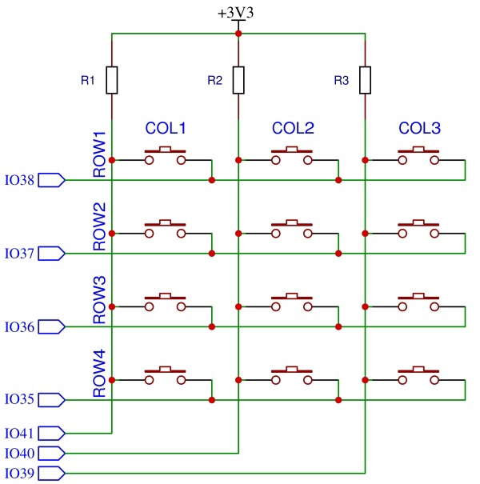
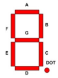
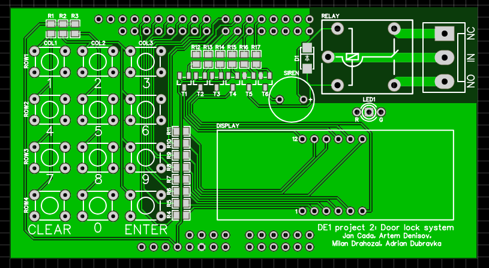
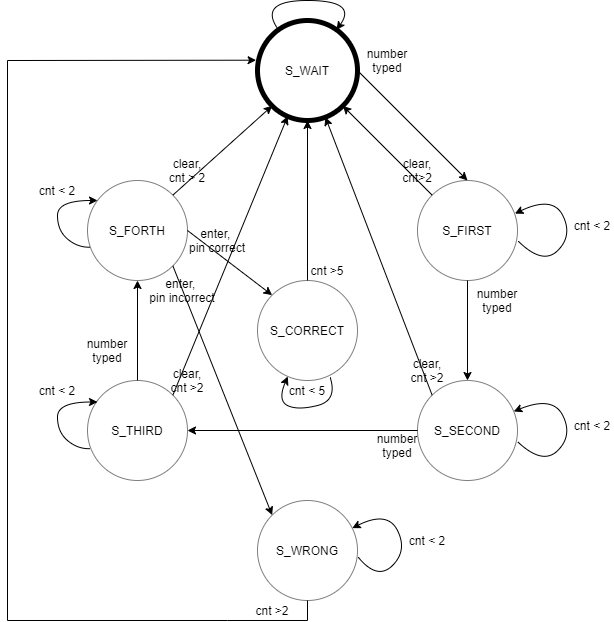

# DE1 project 2: Door lock system with PIN (4-digit) terminal, 4x3 push buttons, 4-digit 7-segment display, relay for door lock control

### Team members

- Jan Čada
- Artem Denisov
- Milan Drahozal
- Adrián Dúbravka

[Link to GitHub project folder](http://github.com/xcadaj00/DE1_project)

### Project objectives

This project goal is to implement door lock system onto board Arty A7-35. It should have 4-digit sevensegment display to show 4-digit PIN and relay to unlock the door. 
As additional features, we added small siren to produce informational sound when pin is correct and door are opened or when pin is incorrect and a dual color LED to show it visually. 

## Hardware description

Used components are connected to Arty A7 board as shield. 

### Schematics

#### Button matrix



#### 4-digit 7-segment display


#### Door lock relay


#### Red/Green LED


#### Siren


### Tables of pins and ports

#### Connection of button matrix 

| Matrix pin | Pin on board | Pin on FPGA | Comment |
| :-:  | :-:  | :-: | :-: |
| COL1 | IO41 | U14 | pullup, used as input for column 1 |
| COL2 | IO40 | V14 | pullup, used as input for column 1 |
| COL3 | IO39 | T13 | pullup, used as input for column 1 |
| ROW1 | IO38 | U12 | when 0, ROW1 buttons can turn COL pins to 0 |
| ROW2 | IO37 | V12 | when 0, ROW2 buttons can turn COL pins to 0 |
| ROW3 | IO36 | V10 | when 0, ROW3 buttons can turn COL pins to 0 |
| ROW4 | IO35 | V11 | when 0, ROW4 buttons can turn COL pins to 0 |

##### Button matrix labels

|      | COL1 | COL2 | COL3 |
| :-: | :-: | :-: | :-: |
| ROW1 | 1 | 2 | 3 |
| ROW2 | 4 | 5 | 6 |
| ROW3 | 7 | 8 | 9 |
| ROW4 | CLEAR | 0 | ENTER |

<!-- | Component | Pin on board | Pin on FPGA |
| :-:  | :-:  | :-: |
| BTN1 | IO38, IO41 | U12, U14 |
| BTN2 | IO38, IO40 | U12, V14 |
| BTN3 | IO38, IO39 | U12, T13 |
| BTN4 | IO37, IO41 | V12, U14 |
| BTN5 | IO37, IO40 | V12, V14 |
| BTN6 | IO37, IO39 | V12, T13 |
| BTN7 | IO36, IO41 | V10, U14 |
| BTN8 | IO36, IO40 | V10, V14 |
| BTN9 | IO36, IO39 | V10, T13 |
| BTN10 | IO35, IO41 | V11, U14 |
| BTN11 | IO35, IO40 | V11, V14 |
| BTN12 | IO35, IO39 | V11, T13 | -->

#### Connection of 7-segment displays



##### Cathodes

LEDs light up when cathode is low (i.e. 0)

| Component | display Pin | Pin on board | Pin on FPGA |
|:-: |:-: | :-:  | :-: |
| A  | 11 | IO7  | G13 |
| B  | 2  | IO8  | B11 |
| C  | 4  | IO10 | A12 |
| D  | 2  | IO12 | D12 |
| E  | 1  | IO13 | D13 |
| F  | 10 | IO34 | B18 |
| G  | 5  | IO9  | A18 |
| DP | 3  | IO11 | K16 |

##### Anodes

Transistor is open when 0V applied to its base, so digit can light up

| Component | display Pin | Pin on board | Pin on FPGA |
|    :-:    |    :-:      |     :-:      |     :-:     |
| A1 | 12 | IO6 | E15 |
| A2 | 9 | IO33 | E16 |
| A3 | 8 | IO32 | D15 |
| A4 | 6 | IO5 | C15 |

#### Connection of Relay

Relay contacts will switch when 3.3V (i.e. 1) is applied to the base of transisor

| Pin on board | Pin on FPGA |
|    :-:    |     :-:    |
| IO31 | K15 |

#### Connection of LED 

LEDs light up when anode is high (i.e. 1)

| Component | Pin on board | Pin on FPGA |
|    :-:    |    :-:     |     :-:     | 
| Green LED | IO3 | J18 |
| Red LED | IO30 | J17 |

#### Connection of Siren

Transistor is open when 3.3V (i.e. 1) is applied to its base, so SIREN will turn on 

| Pin on board | Pin on FPGA |
|    :-:    |     :-:    |
| IO4 | J15 | 


### Tables of components

#### Resistor

| **Label** | **Value** | **Package** | **Quantity** | **Link** |
| :-: | :-: | :-: | :-: | :-: | 
| R1 - R3   | 10K  | 0805 | 3 | [GMe.cz](https://www.gme.cz/r0805-10k-5-yageo) | 
| R4 - R11  | 100R | 0805 | 8 | [GMe.cz](https://www.gme.cz/tc-0104) |
| R12 - R17 | 1K   | 0805 | 6 | [GMe.cz](https://www.gme.cz/r0805-100r-1-yageo) |
| R18       | 110R | 0805 | 1 | [GMe.cz](https://www.gme.cz/r0805-110r-5-yageo) |
| R19       | 130R | 0805 | 1 | [GMe.cz](https://www.gme.cz/r0805-130r-5-yageo) | 

#### Transistor

| **Label** | **Details** | **Type** | **Package** | **Quantity** | **Link** |
| :-: | :-: | :-: | :-: | :-: | :-: |
| T1-T4 | PNP | BC807 | SOT23 | 4 | [GMe.cz](https://www.gme.cz/bipolarni-tranzistor-bc807-16-sot23) |
| T5-T6 | NPN | BC817 | SOT23 | 2 | [GMe.cz](https://www.gme.cz/bipolarni-tranzistor-bc817-40-sot23) |

#### Diode

| **Label** | **Type** | **Package** | **Quantity** | **Link** |
| :-: | :-: | :-: | :-: | :-: |
| D1 | 1N4007 | SOD-123FL | 1 | [GMe.cz](https://www.gme.cz/dioda-1n4007w) |

#### LED

| **Label** | **Type** |**Color** | **Voltage** | **Package** | **Quantity** | **Link** |
| :-: | :-: | :-: | :-: | :-: | :-: | :-: |
| LED1 | LED-BEG204 | Red/Green | 2.0V/2.2V | T1 3/4 | 1 | [GMe.cz](https://www.gme.cz/led-5mm-rg-cc-45-45-50-led-beg204) |

#### Display

| **Label** | **Type** | **Details** | **Color** | **Quantity** | **Link** |
| :-: | :-: | :-: | :-: | :-: | :-: |
| DISPLAY | HD-M514RD | 4-digit 7-segment, common anode | Red | 1 | [GMe.cz](https://www.gme.cz/led-display-14-2mm-red-hd-m514rd) |

#### Relay

| **Label** | **Input voltage** | **Maximum rating** | **Quantity** | **Link** | 
| :-: | :-: | :-: | :-: | :-: |
| RELAY | 5V DC | 250VAC/10A or 24VDC/15A | 1 | [GMe.cz](https://www.gme.cz/relras0515) |

#### Siren

| **Label** | **Type** | **Voltage** | **Quantity** | **Link** | 
| :-: | :-: | :-: | :-: | :-: |
| SIREN | KXG0905C | 5V | 1 | [GMe.cz](https://www.gme.cz/sirenka-kingstate-kxg-0905c) |

#### Switch

| **Type** | **Details** | **Quantity** | **Link** | 
| :-: | :-: | :-: | :-: |
| TC-0107-T | OFF-(ON) -> normally open | 12 | [GMe.cz](https://www.gme.cz/mikrospinac-do-dps-tc-0107-t) | 

#### Connectors

| **Component** | **Quantity** | **Link** | 
| :-: | :-: | :-: |
| 40P Male header 2.54mm | 2 | [GMe.cz](https://www.gme.cz/oboustranny-kolik-s1g40-2-54mm) |
| 3P Screw terminal 5.08mm | 1 | [GMe.cz](https://www.gme.cz/svorkovnice-sroubovaci-do-dps-ark508-3p) |

<!--
### Used parts list

- 2 pcs 40P Male header [GMe.cz](https://www.gme.cz/oboustranny-kolik-s1g40-2-54mm)
- 1 pcs 5V Relay RAS-05-15 [GMe.cz](https://www.gme.cz/relras0515)
- 1 pcs Screw terminal 3P [GMe.cz](https://www.gme.cz/svorkovnice-sroubovaci-do-dps-ark508-3p)
- 1 pcs Diode 1N4007 [GMe.cz](https://www.gme.cz/dioda-1n4007w)
- 4 pcs PNP transistor BC807 [GMe.cz](https://www.gme.cz/bipolarni-tranzistor-bc807-16-sot23)
- 2 pcs NPN transistor BC817 [GMe.cz](https://www.gme.cz/bipolarni-tranzistor-bc817-40-sot23)
- 6 pcs Resistor 1K [GMe.cz](https://www.gme.cz/r0805-1k0-5-yageo)
- 3 pcs Resistor 10K [GMe.cz](https://www.gme.cz/r0805-10k-5-yageo)
- 8 pcs Resistor 100R [GMe.cz](https://www.gme.cz/r0805-100r-1-yageo)
- 1 pcs Resistor 110R [GMe.cz](https://www.gme.cz/r0805-110r-5-yageo)
- 1 pcs Resistor 130R [GMe.cz](https://www.gme.cz/r0805-130r-5-yageo)
- 12 pcs Microswitch OFF-(ON) TC-0107-T [GMe.cz](https://www.gme.cz/mikrospinac-do-dps-tc-0107-t)
- 1 pcs 5mm LED red/green LED-BEG204 (common cathode) [GMe.cz](https://www.gme.cz/led-5mm-rg-cc-45-45-50-led-beg204)
- 1 pcs LED display red HD-M514RD (common anode) [GMe.cz](https://www.gme.cz/led-display-14-2mm-red-hd-m514rd)
- 1 pcs 5V Siren KXG0905C [GMe.cz](https://www.gme.cz/sirenka-kingstate-kxg-0905c)
-->

### PCB design

[PCB design project](https://oshwlab.com/jan.cada/de1_project)

#### Top layer


#### Bottom layer


#### Rendered top



#### Rendered bottom


## VHDL modules description and simulations

### `keyboard.vhd`

This module is used to periodically read pressed buttons from 4*3 matrix keyboard into 4bit output as follows: 

| Button | Binary output | Hexadecimal output |
| :-: | :-: | :-: |
| 0 | `0000` | `0` |
| 1 | `0001` | `1` |
| 2 | `0010` | `2` |
| 3 | `0011` | `3` |
| 4 | `0100` | `4` |
| 5 | `0101` | `5` |
| 6 | `0110` | `6` |
| 7 | `0111` | `7` |
| 8 | `1000` | `8` |
| 9 | `1001` | `9` |
| CLEAR | `1010` | `a` |
| ENTER | `1011` | `b` |
| default | `1111` | `f` |

#### Design module code

```vhdl

```

#### Testbench code

```vhdl

```

#### Simulation output


### `fsm.vhd`

This module is main function module implementing finite state machine

#### State diagram



#### Design module code

```vhdl

```

#### Testbench code

```vhdl

```

#### Simulation output


### `.vhd`

This module ...

#### Design module code

```vhdl

```

#### Testbench code

```vhdl

```

#### Simulation output


## TOP module description and simulations

This module is used to implement `fsm.vhd` onto Arty A7 development board.

#### Design module code

```vhdl

```

## Video

*Write your text here*


## References

   1. 
   
