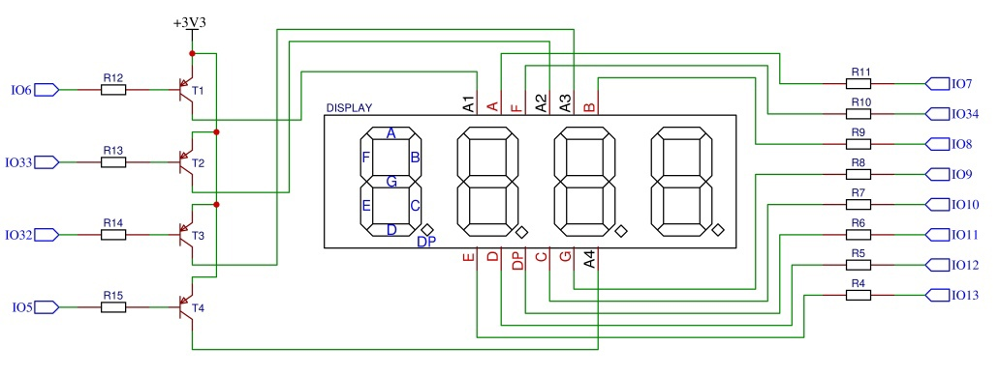
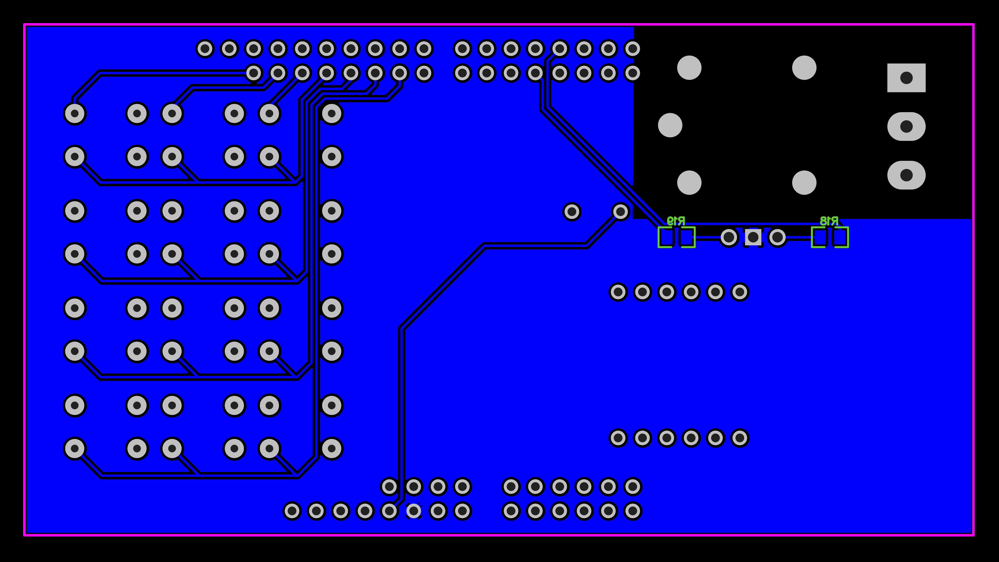

# DE1 project 2: Door lock system with PIN (4-digit) terminal, 4x3 push buttons, 4-digi t 7-segment display, relay for door lock control

### Team members

- Jan Čada
- Artem Denisov
- Milan Drahozal
- Adrián Dúbravka

[Link to GitHub project folder](http://github.com/xcadaj00/DE1_project)

### Project objectives

Project goal is to implement door lock system onto board Arty A7-35T. It should have 4-digit sevensegment display to show 4-digit PIN and relay to unlock the door. 
As additional features, we decided to add small siren to produce sound when pin is incorrect and a dual color LED to light green when pin is correct or light red when pin is incorrect.

## Hardware description

Used components are connected to Arty A7 board as shield. 

### Schematics

#### Button matrix


#### 4-digit 7-segment display



#### Door lock relay


#### Red/Green LED


#### Siren


### Tables of pins and ports

#### Connection of button matrix 

| Matrix pin | Pin on board | Pin on FPGA | Comment |
| :-:  | :-:  | :-: | :-: |
| COL1 | IO41 | N17 | pullup, used as input for column 1 |
| COL2 | IO40 | P18 | pullup, used as input for column 1 |
| COL3 | IO39 | R18 | pullup, used as input for column 1 |
| ROW1 | IO38 | T18 | when 0, ROW1 buttons can turn COL pins to 0 |
| ROW2 | IO37 | U17 | when 0, ROW2 buttons can turn COL pins to 0 |
| ROW3 | IO36 | N14 | when 0, ROW3 buttons can turn COL pins to 0 |
| ROW4 | IO35 | N16 | when 0, ROW4 buttons can turn COL pins to 0 |

##### Button matrix labels

|      | COL1 | COL2 | COL3 |
| :-: | :-: | :-: | :-: |
| ROW1 | 1 | 2 | 3 |
| ROW2 | 4 | 5 | 6 |
| ROW3 | 7 | 8 | 9 |
| ROW4 | CLEAR | 0 | ENTER |

<!-- | Component | Pin on board | Pin on FPGA |
| :-:  | :-:  | :-: |
| BTN1 | IO38, IO41 | U12, U14 |
| BTN2 | IO38, IO40 | U12, V14 |
| BTN3 | IO38, IO39 | U12, T13 |
| BTN4 | IO37, IO41 | V12, U14 |
| BTN5 | IO37, IO40 | V12, V14 |
| BTN6 | IO37, IO39 | V12, T13 |
| BTN7 | IO36, IO41 | V10, U14 |
| BTN8 | IO36, IO40 | V10, V14 |
| BTN9 | IO36, IO39 | V10, T13 |
| BTN10 | IO35, IO41 | V11, U14 |
| BTN11 | IO35, IO40 | V11, V14 |
| BTN12 | IO35, IO39 | V11, T13 | -->

#### Connection of 7-segment displays


##### Cathodes

LEDs light up when cathode is low (i.e. 0)

| Component | display Pin | Pin on board | Pin on FPGA |
|:-: |:-: | :-:  | :-: |
| A  | 11 | IO7  | T16 |
| B  | 2  | IO8  | N15 |
| C  | 4  | IO10 | V17 |
| D  | 2  | IO12 | R17 |
| E  | 1  | IO13 | P17 |
| F  | 10 | IO34 | R16 |
| G  | 5  | IO9  | M16 |
| DP | 3  | IO11 | U18 |

##### Anodes

Transistor is open when 0V applied to its base, so digit can light up

| Component | display Pin | Pin on board | Pin on FPGA |
|    :-:    |    :-:      |     :-:      |     :-:     |
| A1 | 12 | IO6 | T15 |
| A2 | 9 | IO33 | P15 |
| A3 | 8 | IO32 | R15 |
| A4 | 6 | IO5 | T14 |

#### Connection of Relay

Relay contacts will switch when 3.3V (i.e. 1) is applied to the base of transisor

| Pin on board | Pin on FPGA |
|    :-:    |     :-:    |
| IO31 | R13 |

#### Connection of LED 

LEDs light up when anode is high (i.e. 1)

| Component | Pin on board | Pin on FPGA |
|    :-:    |    :-:     |     :-:     | 
| Green LED | IO3 | T11 |
| Red LED | IO30 | R11 |

#### Connection of Siren

Transistor is open when 3.3V (i.e. 1) is applied to its base, so SIREN will turn on 

| Pin on board | Pin on FPGA |
|    :-:    |     :-:    |
| IO4 | R12 | 


### Tables of components

#### Resistor

| **Label** | **Value** | **Package** | **Quantity** | **Link** |
| :-: | :-: | :-: | :-: | :-: | 
| R1 - R3   | 10K  | 0805 | 3 | [GMe.cz](https://www.gme.cz/r0805-10k-5-yageo) | 
| R4 - R11  | 100R | 0805 | 8 | [GMe.cz](https://www.gme.cz/tc-0104) |
| R12 - R17 | 1K   | 0805 | 6 | [GMe.cz](https://www.gme.cz/r0805-100r-1-yageo) |
| R18       | 110R | 0805 | 1 | [GMe.cz](https://www.gme.cz/r0805-110r-5-yageo) |
| R19       | 130R | 0805 | 1 | [GMe.cz](https://www.gme.cz/r0805-130r-5-yageo) | 

#### Transistor

| **Label** | **Details** | **Type** | **Package** | **Quantity** | **Link** |
| :-: | :-: | :-: | :-: | :-: | :-: |
| T1-T4 | PNP | BC807 | SOT23 | 4 | [GMe.cz](https://www.gme.cz/bipolarni-tranzistor-bc807-16-sot23) |
| T5-T6 | NPN | BC817 | SOT23 | 2 | [GMe.cz](https://www.gme.cz/bipolarni-tranzistor-bc817-40-sot23) |

#### Diode

| **Label** | **Type** | **Package** | **Quantity** | **Link** |
| :-: | :-: | :-: | :-: | :-: |
| D1 | 1N4007 | SOD-123FL | 1 | [GMe.cz](https://www.gme.cz/dioda-1n4007w) |

#### LED

| **Label** | **Type** |**Color** | **Voltage** | **Package** | **Quantity** | **Link** |
| :-: | :-: | :-: | :-: | :-: | :-: | :-: |
| LED1 | LED-BEG204 | Red/Green | 2.0V/2.2V | T1 3/4 | 1 | [GMe.cz](https://www.gme.cz/led-5mm-rg-cc-45-45-50-led-beg204) |

#### Display

| **Label** | **Type** | **Details** | **Color** | **Quantity** | **Link** |
| :-: | :-: | :-: | :-: | :-: | :-: |
| DISPLAY | HD-M514RD | 4-digit 7-segment, common anode | Red | 1 | [GMe.cz](https://www.gme.cz/led-display-14-2mm-red-hd-m514rd) |

#### Relay

| **Label** | **Input voltage** | **Maximum rating** | **Quantity** | **Link** | 
| :-: | :-: | :-: | :-: | :-: |
| RELAY | 5V DC | 250VAC/10A or 24VDC/15A | 1 | [GMe.cz](https://www.gme.cz/relras0515) |

#### Siren

| **Label** | **Type** | **Voltage** | **Quantity** | **Link** | 
| :-: | :-: | :-: | :-: | :-: |
| SIREN | KXG0905C | 5V | 1 | [GMe.cz](https://www.gme.cz/sirenka-kingstate-kxg-0905c) |

#### Switch

| **Type** | **Details** | **Quantity** | **Link** | 
| :-: | :-: | :-: | :-: |
| TC-0107-T | OFF-(ON) -> normally open | 12 | [GMe.cz](https://www.gme.cz/mikrospinac-do-dps-tc-0107-t) | 

#### Connectors

| **Component** | **Quantity** | **Link** | 
| :-: | :-: | :-: |
| 40P Male header 2.54mm | 2 | [GMe.cz](https://www.gme.cz/oboustranny-kolik-s1g40-2-54mm) |
| 3P Screw terminal 5.08mm | 1 | [GMe.cz](https://www.gme.cz/svorkovnice-sroubovaci-do-dps-ark508-3p) |

<!--
### Used parts list

- 2 pcs 40P Male header [GMe.cz](https://www.gme.cz/oboustranny-kolik-s1g40-2-54mm)
- 1 pcs 5V Relay RAS-05-15 [GMe.cz](https://www.gme.cz/relras0515)
- 1 pcs Screw terminal 3P [GMe.cz](https://www.gme.cz/svorkovnice-sroubovaci-do-dps-ark508-3p)
- 1 pcs Diode 1N4007 [GMe.cz](https://www.gme.cz/dioda-1n4007w)
- 4 pcs PNP transistor BC807 [GMe.cz](https://www.gme.cz/bipolarni-tranzistor-bc807-16-sot23)
- 2 pcs NPN transistor BC817 [GMe.cz](https://www.gme.cz/bipolarni-tranzistor-bc817-40-sot23)
- 6 pcs Resistor 1K [GMe.cz](https://www.gme.cz/r0805-1k0-5-yageo)
- 3 pcs Resistor 10K [GMe.cz](https://www.gme.cz/r0805-10k-5-yageo)
- 8 pcs Resistor 100R [GMe.cz](https://www.gme.cz/r0805-100r-1-yageo)
- 1 pcs Resistor 110R [GMe.cz](https://www.gme.cz/r0805-110r-5-yageo)
- 1 pcs Resistor 130R [GMe.cz](https://www.gme.cz/r0805-130r-5-yageo)
- 12 pcs Microswitch OFF-(ON) TC-0107-T [GMe.cz](https://www.gme.cz/mikrospinac-do-dps-tc-0107-t)
- 1 pcs 5mm LED red/green LED-BEG204 (common cathode) [GMe.cz](https://www.gme.cz/led-5mm-rg-cc-45-45-50-led-beg204)
- 1 pcs LED display red HD-M514RD (common anode) [GMe.cz](https://www.gme.cz/led-display-14-2mm-red-hd-m514rd)
- 1 pcs 5V Siren KXG0905C [GMe.cz](https://www.gme.cz/sirenka-kingstate-kxg-0905c)
-->

### PCB design

[PCB design project](https://oshwlab.com/jan.cada/de1_project)

#### Top layer


#### Bottom layer



#### Rendered top


#### Rendered bottom


## VHDL modules description and simulations

### `keyboard.vhd`

This module is used to periodically read pressed buttons from 4*3 matrix keyboard into 4bit output as follows: 

| Button | Binary output | Hexadecimal output |
| :-: | :-: | :-: |
| 0 | `0000` | `0` |
| 1 | `0001` | `1` |
| 2 | `0010` | `2` |
| 3 | `0011` | `3` |
| 4 | `0100` | `4` |
| 5 | `0101` | `5` |
| 6 | `0110` | `6` |
| 7 | `0111` | `7` |
| 8 | `1000` | `8` |
| 9 | `1001` | `9` |
| CLEAR | `1010` | `a` |
| ENTER | `1011` | `b` |
| default | `1111` | `f` |

`p_keyboard` process receives a 3-bit vector that indicates a specific column with a value of 0 (011 - first, 101 - second, 110 - third, 111 - no input). The process runs through a loop every 100 ms (10 ns for faster simulation), periodically changing the values of the 4-bit row vector and sets the output value based on the input vector and the momentary row value.
`clock_enable` module from Labs is used here. 

#### Design module code

```vhdl
library ieee;
use ieee.std_logic_1164.all;
--use ieee.numeric_std.all;

entity keyboard is 
port(
    clk		:   in  std_logic;
    reset    	:   in  std_logic;
    col_i	:   in  std_logic_vector(2 downto 0);
    row_o	:   out std_logic_vector(3 downto 0);	
    button_o	:   out std_logic_vector(3 downto 0)
);
end keyboard;

architecture Behavioral of keyboard is
    type   row_type is (row_1, row_2, row_3, row_4);
    signal s_row    : row_type;    
    signal en       : std_logic;

begin
    clk_en0 : entity work.clock_enable
        generic map(
            g_MAX   => 1 -- 1 for faster simulation, for implementation 10000000 - 100ms with 100MHz signal
        )
        port map(
            clk     => clk,
            reset   => reset,
            ce_o    => en
        );

    p_keyboard: process(clk)
	begin
        if (rising_edge (clk)) then
            if (reset = '1') then
                s_row <= row_1;
                row_o <= "1111";
                button_o <= "1111";
            elsif (en = '1') then
                button_o <= "1111";
                case s_row is
                    when row_1 =>
                        row_o <= "0111";
                        if (col_i = "011") then
                            button_o <= "0001"; -- 1
                        elsif (col_i = "101") then
                            button_o <= "0010"; -- 2
                        elsif (col_i = "110") then
                            button_o <= "0011"; -- 3
                        else
                            s_row <= row_2;
                        end if;
                    when row_2 =>
                        row_o <= "1011";
                        if (col_i = "011") then
                            button_o <= "0100"; -- 4
                        elsif (col_i = "101") then
                            button_o <= "0101"; -- 5
                        elsif (col_i = "110") then
                            button_o <= "0110"; -- 6
                        else
                            s_row <= row_3;
                        end if;
                    when row_3 =>
                        row_o <= "1101";
                        if (col_i = "011") then
                            button_o <= "0111"; -- 7
                        elsif (col_i = "101") then
                            button_o <= "1000"; -- 8
                        elsif (col_i = "110") then
                            button_o <= "1001"; -- 9
                        else
                            s_row <= row_4;
                        end if;
                    when row_4 =>
                        row_o <= "1110";
                        if (col_i = "011") then
                            button_o <= "1010"; -- clear
                        elsif (col_i = "101") then
                            button_o <= "0000"; -- 0
                        elsif (col_i = "110") then
                            button_o <= "1011"; -- enter
                        else
                            s_row <= row_1;
                        end if;
                    when others => s_row <= row_1;
                end case;
            end if;
        end if;
    end process p_keyboard;
end;

```

#### Testbench code

```vhdl
library IEEE;
use IEEE.STD_LOGIC_1164.ALL;
--use ieee.numeric_std.all;

entity tb_keyboard is
--  Port ( );
end tb_keyboard;

architecture testbench of tb_keyboard is
    constant c_CLK_100MHZ_PERIOD : time    := 10 ns;

    --Local signals
    signal s_clk_100MHz : std_logic;
    signal s_reset      : std_logic;
    signal s_col	: std_logic_vector(2 downto 0);
    signal s_row	: std_logic_vector(3 downto 0);
    signal s_button 	: std_logic_vector(3 downto 0);	
begin
    uut_keyboard : entity work.keyboard
        port map(
            clk      => s_clk_100MHz,
            reset    => s_reset,
            col_i    => s_col,
            row_o    => s_row,
            button_o => s_button 
        );

    --------------------------------------------------------------------
    -- Clock generation process
    --------------------------------------------------------------------
    p_clk_gen : process
    begin
        while now < 750 ns loop         -- 75 periods of 100MHz clock
            s_clk_100MHz <= '0';
            wait for c_CLK_100MHZ_PERIOD / 2;
            s_clk_100MHz <= '1';
            wait for c_CLK_100MHZ_PERIOD / 2;
        end loop;
        wait;
    end process p_clk_gen;
    
    --------------------------------------------------------------------
    -- Data generation process
    --------------------------------------------------------------------
    p_stimulus : process
    begin
        report "Stimulus process started" severity note;
        report "running keyboard tests" severity note;
        
        s_reset <= '0'; wait for 10 ns;
        s_reset <= '1'; wait for 10 ns;
        assert(s_button = "1111") report "Test failed for (RESET)" severity error;
        
        s_reset <= '0'; wait for 15 ns;
        
        s_col <= "111"; wait for 40 ns;
        assert(s_button = "1111") report "Test failed for (NO INPUT)" severity error;
        
        s_col <= "011"; wait for 40 ns;
        assert(s_button = "0001") report "Test failed for (1)" severity error;
        
        s_col <= "101"; wait for 40 ns;
        assert(s_button = "0010") report "Test failed for (2)" severity error;
        
        s_col <= "110"; wait for 40 ns;
        assert(s_button = "0011") report "Test failed for (3)" severity error;
        
        s_col <= "111"; wait for 10 ns;
        
        s_col <= "011"; wait for 20 ns;
        assert(s_button = "0100") report "Test failed for (4)" severity error;
        
        s_col <= "101"; wait for 20 ns;
        assert(s_button = "0101") report "Test failed for (5)" severity error;
        
        s_col <= "110"; wait for 20 ns;
        assert(s_button = "0110") report "Test failed for (6)" severity error;
        
        s_col <= "111"; wait for 10 ns;
        
        s_col <= "011"; wait for 30 ns;
        assert(s_button = "0111") report "Test failed for (7)" severity error;
        
        s_col <= "101"; wait for 30 ns;
        assert(s_button = "1000") report "Test failed for (8)" severity error;
        
        s_col <= "110"; wait for 30 ns;
        assert(s_button = "1001") report "Test failed for (9)" severity error;
        
        s_col <= "111"; wait for 10 ns;
        
        s_col <= "011"; wait for 40 ns;
        assert(s_button = "1010") report "Test failed for (CLEAR)" severity error;
        
        s_col <= "101"; wait for 40 ns;
        assert(s_button = "0000") report "Test failed for (0)" severity error;
        
        s_col <= "110"; wait for 40 ns;
        assert(s_button = "1011") report "Test failed for (ENTER)" severity error;
        
        report "Stimulus process finished" severity note;
        wait;
    end process p_stimulus;
end testbench;
```

#### Simulation output


### `fsm.vhd`

This module is main function module implementing finite state machine. 
This module has 4bit input, where keyboard can be connected. 
It has also outputs for display (4bit value for each digit, "1111" (i.e. hex 'F') means blank), relay and dualcolor LED (2bit anode value) and siren. 
PIN "4321" is hardcoded as constant in this module. 
`clock_enable` module from Labs is used here. 


#### State diagram


#### Design module code

```vhdl
library IEEE;
use IEEE.STD_LOGIC_1164.ALL;
use ieee.numeric_std.all;

-- Uncomment the following library declaration if using
-- arithmetic functions with Signed or Unsigned values
--use IEEE.NUMERIC_STD.ALL;

-- Uncomment the following library declaration if instantiating
-- any Xilinx leaf cells in this code.
--library UNISIM;
--use UNISIM.VComponents.all;

entity fsm is
    Port ( 
        clk        : in  std_logic;
        reset      : in  std_logic;
        keyboard_i : in  std_logic_vector (4 - 1 downto 0);
        data0_o    : out std_logic_vector (4 - 1 downto 0);
        data1_o    : out std_logic_vector (4 - 1 downto 0);
        data2_o    : out std_logic_vector (4 - 1 downto 0);
        data3_o    : out std_logic_vector (4 - 1 downto 0);
        led_o      : out std_logic_vector (2 - 1 downto 0);
        relay_o    : out std_logic;
        siren_o    : out std_logic
    );
end fsm;

architecture Behavioral of fsm is

-- Define the states
    type t_state is (S_WAIT,
                     S_FIRST,
                     S_SECOND,
                     S_THIRD,
                     S_FORTH,
                     S_CORRECT,
                     S_WRONG
                     );
    -- Define the signal that uses different states
    signal s_state  : t_state;

    -- Internal clock enable
    signal s_en     : std_logic;
    -- Local delay counter
    signal s_cnt    : unsigned(5 - 1 downto 0);

    -- Specific values for local counter
    constant c_DELAY_2SEC   : unsigned(5 - 1 downto 0)  := b"0_1000";
    constant c_DELAY_5SEC   : unsigned(5 - 1 downto 0)  := b"1_0100";
    constant c_ZERO         : unsigned(5 - 1 downto 0)  := b"0_0000";
    
    -- Hardcoded PIN 4321
    constant c_pin0         : std_logic_vector(4 - 1 downto 0) := "0100"; 
    constant c_pin1         : std_logic_vector(4 - 1 downto 0) := "0011";
    constant c_pin2         : std_logic_vector(4 - 1 downto 0) := "0010";
    constant c_pin3         : std_logic_vector(4 - 1 downto 0) := "0001";
    
    -- signals to store typed pin values to compare with the constant
    signal   s_pin0         : std_logic_vector(4 - 1 downto 0); 
    signal   s_pin1         : std_logic_vector(4 - 1 downto 0);
    signal   s_pin2         : std_logic_vector(4 - 1 downto 0);
    signal   s_pin3         : std_logic_vector(4 - 1 downto 0);
    
    signal   s_last         : std_logic_vector(4 - 1 downto 0); -- internal signal to store last pressed value to prevent long press problem
    
begin

--------------------------------------------------------------------
    -- Instance (copy) of clock_enable entity generates an enable pulse
    -- every 250 ms (4 Hz). Remember that the frequency of the clock 
    -- signal is 100 MHz.
    
    -- JUST FOR SHORTER/FASTER SIMULATION
    -- s_en <= '1';
    clk_en0 : entity work.clock_enable
        generic map(
            g_MAX => 25 -- correctly 25000000, for faster simulation 25  -- g_MAX = 250 ms / (1/100 MHz)
        )
        port map(
            clk   => clk,
            reset => reset,
            ce_o  => s_en
        );

    --------------------------------------------------------------------
    -- p_doorlock_fsm:
    -- The sequential process with synchronous reset and clock_enable 
    -- entirely controls the s_state signal by CASE statement.
    --------------------------------------------------------------------
    p_doorlock_fsm : process(clk)
    begin
        if rising_edge(clk) then
            if (reset = '1') then         -- Synchronous reset
                s_state    <= S_WAIT;     -- Set initial state
                s_cnt      <= c_ZERO;     -- Clear all bits
                
                data3_o    <= "1111";     -- init digit 3 to blank
                data2_o    <= "1111";     -- init digit 2 to blank
                data1_o    <= "1111";     -- init digit 1 to blank
                data0_o    <= "1111";     -- init digit 0 to blank
                
                led_o      <= "00";       -- turn off dualcolor LED
                relay_o    <= '0';        -- turn off relay
                siren_o    <= '0';        -- turn off siren
                
                s_last     <= "1111";     -- init state

            elsif (s_en = '1' and (keyboard_i = "1111" or keyboard_i /= s_last)) then
                --Every 250 ms, CASE checks the value of the s_state 
                --variable and changes to the next state according 
                -- to the delay value, if the button that was pressed previously is not pressed now
                
                s_last <= keyboard_i;
                
                case s_state is

                    when S_WAIT =>
                        if (keyboard_i /= "1111" and keyboard_i /= "1010" and keyboard_i /= "1011") then
                            -- First number typed
                            s_pin0    <= keyboard_i; -- load it into local signal
                            data3_o   <= keyboard_i; -- show that number on the first digit of display
                            s_state   <= S_FIRST;    -- go to state S_FIRST
                        end if;

                    when S_FIRST =>
                        if (keyboard_i = "1010") then -- clear was pressed
                            s_cnt     <= c_ZERO;
                            s_state   <= S_WAIT;
                            data3_o   <= "1111";      -- init digit 3 to blank                   
                        elsif (keyboard_i /= "1111" and keyboard_i /= "1011") then
                            -- Second number typed
                            s_pin1    <= keyboard_i; -- load it into local signal
                            data2_o   <= keyboard_i; -- show that number on the second digit of display
                            s_cnt     <= c_ZERO;     -- clear counter bits
                            s_state   <= S_SECOND;   -- go to state S_SECOND
                        elsif (s_cnt < c_DELAY_2SEC) then
                            s_cnt <= s_cnt + 1;
                        else -- 2 sec delay is over
                            s_cnt     <= c_ZERO;
                            s_state   <= S_WAIT;
                            data3_o   <= "1111";     -- init digit 3 to blank
                        end if;
                        
                    when S_SECOND =>
                        if (keyboard_i = "1010") then -- clear was pressed
                            s_cnt     <= c_ZERO;
                            s_state   <= S_WAIT;
                            data3_o   <= "1111";     -- init digit 3 to blank
                            data2_o   <= "1111";     -- init digit 2 to blank
                        elsif (keyboard_i /= "1111" and keyboard_i /= "1011") then
                            -- Third number typed
                            s_pin2    <= keyboard_i; -- load it into local signal
                            data1_o   <= keyboard_i; -- show that number on the third digit of display
                            s_cnt     <= c_ZERO;
                            s_state   <= S_THIRD;    -- go to state S_THIRD
                        elsif (s_cnt < c_DELAY_2SEC) then
                            s_cnt <= s_cnt + 1;
                        else
                            s_cnt      <= c_ZERO;
                            s_state    <= S_WAIT;
                            data3_o    <= "1111";     -- init digit 3 to blank
                            data2_o    <= "1111";     -- init digit 2 to blank
                        end if;
                      
                    when S_THIRD =>
                        if (keyboard_i = "1010") then -- clear was pressed
                            s_cnt     <= c_ZERO;
                            s_state   <= S_WAIT;
                            data3_o    <= "1111";     -- init digit 3 to blank
                            data2_o    <= "1111";     -- init digit 2 to blank
                            data1_o    <= "1111";     -- init digit 1 to blank
                        elsif (keyboard_i /= "1111" and keyboard_i /= "1011") then
                            -- Forth number typed
                            s_pin3    <= keyboard_i; -- load it into local signal
                            data0_o   <= keyboard_i; -- show that number on the forth digit of display
                            s_cnt     <= c_ZERO;
                            s_state   <= S_FORTH;    -- go to state S_FORTH
                        elsif (s_cnt < c_DELAY_2SEC) then
                            s_cnt <= s_cnt + 1;
                        else
                            s_cnt     <= c_ZERO;
                            s_state   <= S_WAIT;
                            data3_o    <= "1111";     -- init digit 3 to blank
                            data2_o    <= "1111";     -- init digit 2 to blank
                            data1_o    <= "1111";     -- init digit 1 to blank
                        end if;
                        
                    when S_FORTH =>
                        if (keyboard_i = "1010") then -- clear was pressed
                            s_cnt     <= c_ZERO;
                            s_state   <= S_WAIT;
                            data3_o   <= "1111";     -- init digit 3 to blank
                            data2_o   <= "1111";     -- init digit 2 to blank
                            data1_o   <= "1111";     -- init digit 1 to blank
                            data0_o   <= "1111";     -- init digit 0 to blank
                        elsif (keyboard_i = "1011") then -- enter was pressed
                            data3_o   <= "1111";     -- init digit 3 to blank
                            data2_o   <= "1111";     -- init digit 2 to blank
                            data1_o   <= "1111";     -- init digit 1 to blank
                            data0_o   <= "1111";     -- init digit 0 to blank
                            s_cnt     <= c_ZERO;
                            if (s_pin0 = c_pin0 and s_pin1 = c_pin1 and s_pin2 = c_pin2 and s_pin3 = c_pin3) then 
                                -- pin correct
                                relay_o   <= '1';    -- open the door
                                led_o     <= "01";   -- show green light
                                s_state   <= S_CORRECT;  -- go to state S_CORRECT
                            else
                                -- pin incorrect
                                siren_o   <= '1';    -- turn on siren
                                led_o     <= "10";   -- show red light
                                s_state   <= S_WRONG;    -- go to state S_WRONG
                            end if;
                        elsif (s_cnt < c_DELAY_2SEC) then
                            s_cnt <= s_cnt + 1;
                        else
                            s_cnt     <= c_ZERO;
                            s_state   <= S_WAIT;
                            data3_o   <= "1111";     -- init digit 3 to blank
                            data2_o   <= "1111";     -- init digit 2 to blank
                            data1_o   <= "1111";     -- init digit 1 to blank
                            data0_o   <= "1111";     -- init digit 0 to blank
                        end if;
                      
                    when S_CORRECT =>
                        if (s_cnt < c_DELAY_5SEC) then
                            s_cnt <= s_cnt + 1;
                        else
                            relay_o   <= '0';    -- turn off relay
                            led_o     <= "00";   -- turn off LED
                            -- Move to the next state
                            s_state <= S_WAIT;
                            -- Reset local counter value
                            s_cnt   <= c_ZERO;
                        end if;
                        
                    when S_WRONG =>
                        if (s_cnt < c_DELAY_2SEC) then
                            s_cnt <= s_cnt + 1;
                        else
                            siren_o   <= '0';    -- turn off siren
                            led_o     <= "00";   -- turn off LED
                            -- Move to the next state
                            s_state <= S_WAIT;
                            -- Reset local counter value
                            s_cnt   <= c_ZERO;
                        end if;
                                    
                    -- It is a good programming practice to use the 
                    -- OTHERS clause, even if all CASE choices have 
                    -- been made. 
                    when others =>
                        s_state <= S_WAIT;

                end case;
            end if; -- Synchronous reset
        end if; -- Rising edge
    end process p_doorlock_fsm;

end Behavioral;

```

#### Testbench code

```vhdl
library ieee;
use ieee.std_logic_1164.all;

------------------------------------------------------------------------
-- Entity declaration for testbench
------------------------------------------------------------------------
entity tb_fsm is
    -- Entity of testbench is always empty
end entity tb_fsm;

------------------------------------------------------------------------
-- Architecture body for testbench
------------------------------------------------------------------------
architecture testbench of tb_fsm is

    -- Local constants
    constant c_CLK_100MHZ_PERIOD : time    := 10 ns;

    --Local signals
    signal s_clk_100MHz : std_logic;
    signal s_reset      : std_logic;
    signal s_keyboard   : std_logic_vector(4 - 1 downto 0);
    signal s_disp1      : std_logic_vector(4 - 1 downto 0);
    signal s_disp2      : std_logic_vector(4 - 1 downto 0);
    signal s_disp3      : std_logic_vector(4 - 1 downto 0);
    signal s_disp4      : std_logic_vector(4 - 1 downto 0);
    signal s_led        : std_logic_vector(2 - 1 downto 0);
    signal s_relay      : std_logic;
    signal s_siren      : std_logic;

begin
    -- Connecting testbench signals with tlc entity (Unit Under Test)
    uut_fsm : entity work.fsm
        port map(
            clk        => s_clk_100MHz,
            reset      => s_reset,
            keyboard_i => s_keyboard, 
            data3_o    => s_disp1,
            data2_o    => s_disp2, 
            data1_o    => s_disp3, 
            data0_o    => s_disp4,
            led_o      => s_led,    
            relay_o    => s_relay,  
            siren_o    => s_siren
            
        );

    --------------------------------------------------------------------
    -- Clock generation process
    --------------------------------------------------------------------
    p_clk_gen : process
    begin
        while now < 60 us loop   -- 10 usec of simulation
            s_clk_100MHz <= '0';
            wait for c_CLK_100MHZ_PERIOD / 2;
            s_clk_100MHz <= '1';
            wait for c_CLK_100MHZ_PERIOD / 2;
        end loop;
        wait;
    end process p_clk_gen;

    --------------------------------------------------------------------
    -- Reset generation process
    --------------------------------------------------------------------
    p_reset_gen : process
    begin
        s_reset <= '0'; wait for 1 us;
        -- Reset activated
        s_reset <= '1'; wait for 1 us;
        -- Reset deactivated
        s_reset <= '0';
        wait;
    end process p_reset_gen;

    --------------------------------------------------------------------
    -- Data generation process
    --------------------------------------------------------------------
    p_stimulus : process
    begin
        -- try bad pin
        s_keyboard <= "1111";
        wait for 3 us;
        s_keyboard <= "0000";
        wait for 0.5 us;
        s_keyboard <= "1111";
        wait for 1 us;
        s_keyboard <= "0001";
        wait for 0.5 us;
        s_keyboard <= "1111";
        wait for 1 us;
        s_keyboard <= "0010";
        wait for 0.5 us;
        s_keyboard <= "1111";
        wait for 1 us;
        s_keyboard <= "0011";
        wait for 0.5 us;
        s_keyboard <= "1111";
        wait for 1 us;
        s_keyboard <= "1011";
        wait for 0.5 us;
        s_keyboard <= "1111";
        wait for 3 us;
        
        -- try timeout
        s_keyboard <= "0000";
        wait for 0.5 us;
        s_keyboard <= "1111";
        wait for 1 us;
        s_keyboard <= "0001";
        wait for 0.5 us;
        s_keyboard <= "1111";
        wait for 3 us;
        
        -- try clear
        s_keyboard <= "0000";
        wait for 0.5 us;
        s_keyboard <= "1111";
        wait for 1 us;
        s_keyboard <= "0001";
        wait for 0.5 us;
        s_keyboard <= "1111";
        wait for 1 us;
        s_keyboard <= "1010";
        wait for 0.5 us;
        s_keyboard <= "1111";
        wait for 1 us;
        
        -- try correct pin
        s_keyboard <= "0100";
        wait for 0.5 us;
        s_keyboard <= "1111";
        wait for 1 us;
        s_keyboard <= "0011";
        wait for 0.5 us;
        s_keyboard <= "1111";
        wait for 1 us;
        s_keyboard <= "0010";
        wait for 0.5 us;
        s_keyboard <= "1111";
        wait for 1 us;
        s_keyboard <= "0001";
        wait for 0.5 us;
        s_keyboard <= "1111";
        wait for 1 us;
        s_keyboard <= "1011";
        wait for 0.5 us;
        s_keyboard <= "1111";
        wait for 3 us;

        wait;
    end process p_stimulus;

end architecture testbench;
```

#### Simulation output

##### Reset test


##### Wrong pin test


##### Timeout and clear button test


##### Correct pin test


## TOP module description and simulations

This module is used to implement all modules onto Arty A7-35T development board. 
Module `driver_7seg_4digits` from Labs is used here with small change, F cathode value in `hex_7seg` module is set to "1111111" as blank digit. 
There are also modules `clock_enable`, `cnt_up_down` inside this driver module. 

#### Design module code

```vhdl
library IEEE;
use IEEE.STD_LOGIC_1164.ALL;

-- Uncomment the following library declaration if using
-- arithmetic functions with Signed or Unsigned values
--use IEEE.NUMERIC_STD.ALL;

-- Uncomment the following library declaration if instantiating
-- any Xilinx leaf cells in this code.
--library UNISIM;
--use UNISIM.VComponents.all;

entity top is
    Port (
        CLK100MHZ  : in  std_logic; -- CLOCK
        BTN0       : in  std_logic; -- RST button
        
        IO41       : in  std_logic; -- COL1
        IO40       : in  std_logic; -- COL2
        IO39       : in  std_logic; -- COL3
        
        IO38       : out std_logic; -- ROW1
        IO37       : out std_logic; -- ROW2
        IO36       : out std_logic; -- ROW3
        IO35       : out std_logic; -- ROW4
        
        IO7        : out std_logic; -- A
        IO8        : out std_logic; -- B
        IO10       : out std_logic; -- C
        IO12       : out std_logic; -- D
        IO13       : out std_logic; -- E
        IO34       : out std_logic; -- F
        IO9        : out std_logic; -- G
        IO11       : out std_logic; -- DP
        
        IO6        : out std_logic; -- A1
        IO33       : out std_logic; -- A2
        IO32       : out std_logic; -- A3
        IO5        : out std_logic; -- A4
        
        IO31       : out std_logic; -- Relay
        
        IO3        : out std_logic; -- RED LED
        IO30       : out std_logic; -- GREEN LED
        
        IO4        : out std_logic  -- Siren
        
     );
end top;

architecture Behavioral of top is

-- internal signals
signal s_keyboard : std_logic_vector (4 - 1 downto 0);
signal s_data3    : std_logic_vector (4 - 1 downto 0);
signal s_data2    : std_logic_vector (4 - 1 downto 0);
signal s_data1    : std_logic_vector (4 - 1 downto 0);
signal s_data0    : std_logic_vector (4 - 1 downto 0);


begin

fsm : entity work.fsm
    port map(
        clk        => CLK100MHZ,
        reset      => BTN0,
        keyboard_i => s_keyboard,
        data0_o    => s_data0,
        data1_o    => s_data1,
        data2_o    => s_data2,
        data3_o    => s_data3,
        led_o(0)   => IO3,
        led_o(1)   => IO30,
        relay_o    => IO31,
        siren_o    => IO4
    );
    
keyboard : entity work.keyboard
    port map(
        clk	  => CLK100MHZ, 
        reset     => BTN0,
        col_i(0)  => IO41,
        col_i(1)  => IO40,
        col_i(2)  => IO39,   
        row_o(0)  => IO38,
        row_o(1)  => IO37,
        row_o(2)  => IO36,
        row_o(3)  => IO35,
        button_o  => s_keyboard	
    );
    
driver_7seg_4digits : entity work.driver_7seg_4digits
    port map(
         clk      => CLK100MHZ,   
         reset    => BTN0,
         
         data0_i  => s_data0,
         data1_i  => s_data1,
         data2_i  => s_data2,
         data3_i  => s_data3,
         
         dp_i     => "1111",
         
         dp_o     => IO11,
         
         seg_o(0) => IO7, 
         seg_o(1) => IO8, 
         seg_o(2) => IO10,
         seg_o(3) => IO12,
         seg_o(4) => IO13,
         seg_o(5) => IO34,
         seg_o(6) => IO9,
         
         dig_o(3) => IO6,  
         dig_o(2) => IO33, 
         dig_o(1) => IO32, 
         dig_o(0) => IO5  
    );


end Behavioral;

```

## Video

*Write your text here*

## Conclusion


## References

   1. 
   
